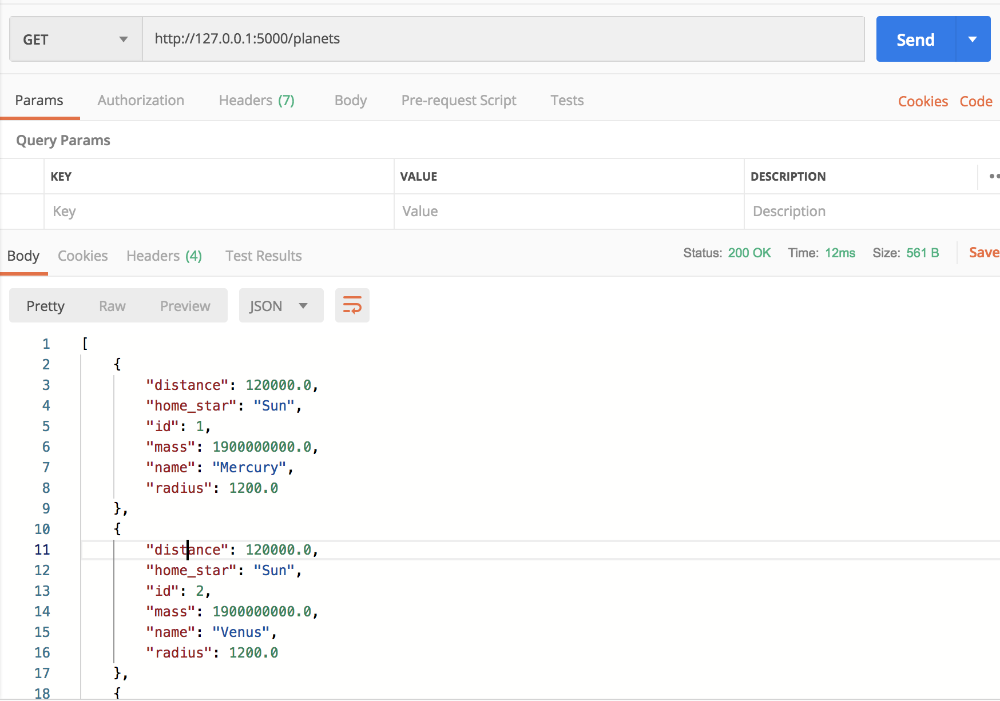

# milkyway-api

## Description
A REST API which informs you about the different 
planets present/discovered in the Milky Way Galaxy. :)
It will return the different parameters assciated with
the planets in json format.

For more information regarding how to consume this API,
refer to the details below.
 
## Example
### Get the list of planets
Returns json data about all planets currently present in the Milky Way.

* **URL**

    /planets

* **Method:**

  `GET`
  
*  **URL Params**

   **Required:**
 
   None

* **Data Params**

  None

* **Success Response:**

  * **Code:** 200  
    **Content:**
    
        {
            "distance": 120000.0,
            "home_star": "Sun",
            "id": 2,
            "mass": 1900000000.0,
            "name": "Venus",
            "radius": 1200.0
        }, {
            "distance": 2000000000000.0,
            "home_star": "Sol",
            "id": 3,
            "mass": 19000000.0,
            "name": "Neptune",
            "radius": 9877889.0
        }
 
* **Error Response:**
  * **Code:** 401 UNAUTHORIZED  
    **Content:** 
    
        { "message" : "You are unauthorized to make 
                        this request." }
    
    **Reason**
        
        You need to be logged-in before making this 
        call.

* **Sample Call using Postman on localhost:**

    
    
## Contribution

## Improvements
Make the REST API robust and production ready.